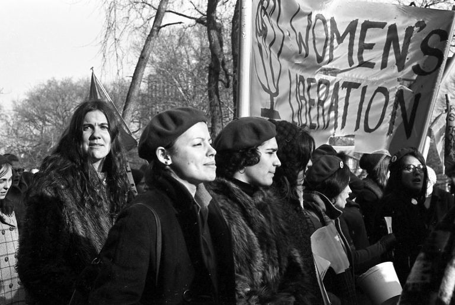

# Applied Data Science @ Columbia
## Fall 2019
## Project 1: A "data story" on the songs of our times


### [Project Description](doc/Proj1_desc.md)

+ Projec title: Is Music a Represenatation of Social Movement?
+ This project is conducted by Dingyi Fang (df2709).

+ Project summary: Here I conduct an analysis about the relationship between lyrics and social movement. In generally, this was done by using text mining, wordcloud and sentiment analysis for different genre across different periods. This study showed that during there was a dramatic change in top 10 words between 1970s and 1980s. Moreover, the setiment like anger, sadness appeared to dominate the entire genre. 



### [Project Report](doc/Project1_df2709_dingyif.html)

### [Project Code](doc/Project1_df2709_dingyif.Rmd)

Following [suggestions](http://nicercode.github.io/blog/2013-04-05-projects/) by [RICH FITZJOHN](http://nicercode.github.io/about/#Team) (@richfitz). This folder is orgarnized as follows.

```
proj/
|-- R/
|-- data/
|-- doc/
|-- figs/
|-- output/
|-- analysis.R
```

Please see each subfolder for a README file.
